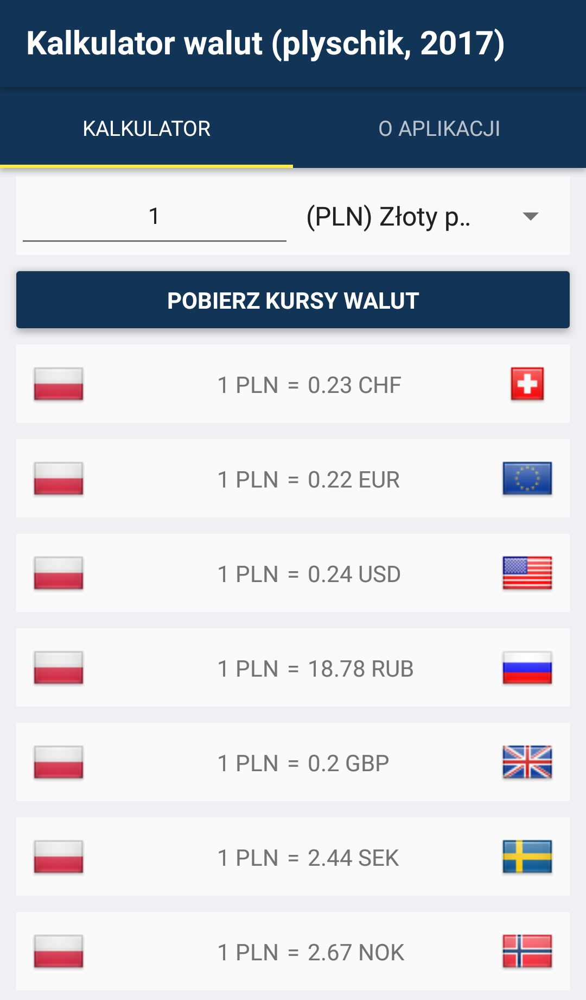
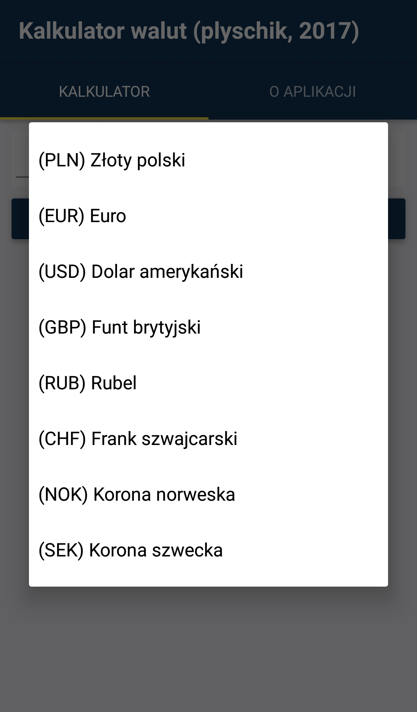
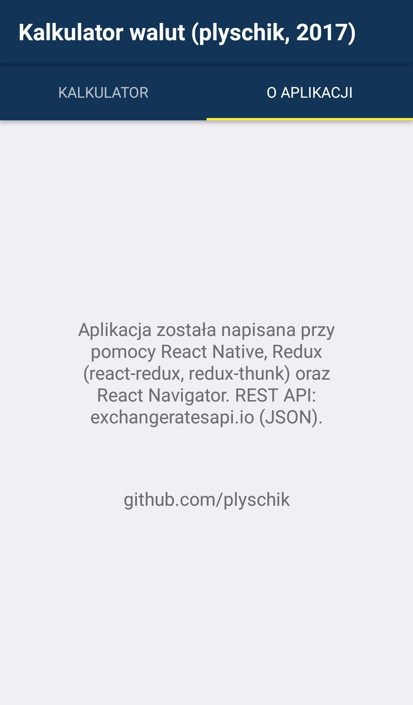

# Konwerter walut - aplikacja mobilna

Aplikacja mobilna, która pozwala na konwersję ilości pieniędzy pomiędzy ośmioma najpopularniejszymi w Polsce walutami. Do stworzenia aplikacji wykorzystano bibliotekę [React Native](https://reactnative.dev) w połączeniu z [React Redux](https://react-redux.js.org) oraz [React Navigator](https://reactnavigation.org). Dane na temat kursów walut pobierane są z zewnętrznego RESTful API: [exchangeratesapi.io](https://exchangeratesapi.io).

